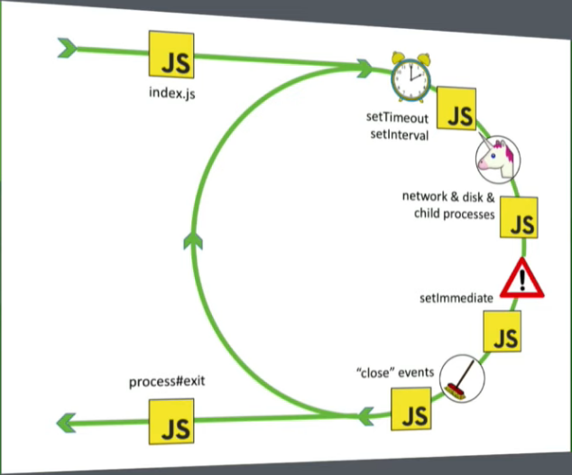
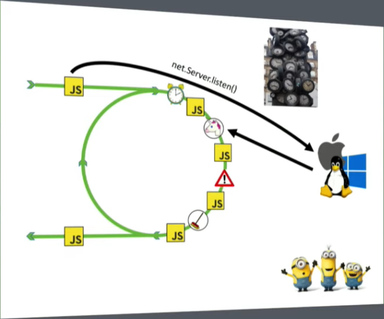
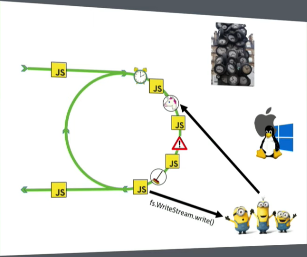
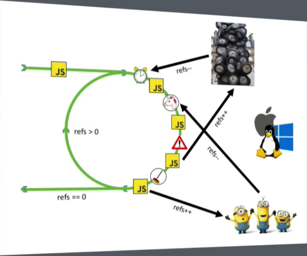
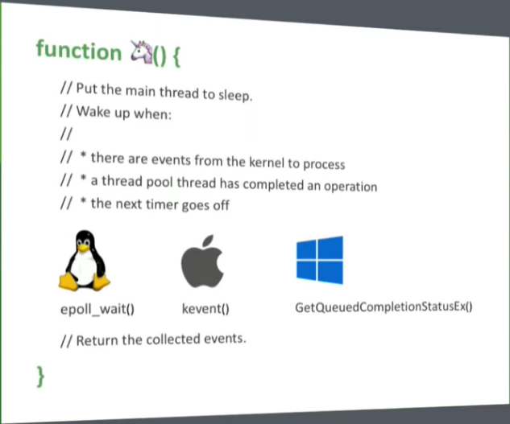
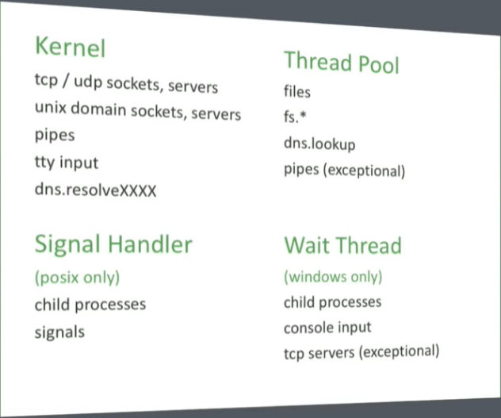

# Libuv

## Definition

The libuv write in c++, is a multi-platform support library with a focus on asynchronous I/O.

## Powers

The libuv empowers nodeJs, like a talk with the OS and has as it main component, the event loop that process all the javascript code in single thread, only when needed (heavy processing), executes it in multi thread with up to 4 threads (by default).

> [show me the code 🧐](code/multi-thread.js)

### Features [#ref](https://github.com/libuv/libuv)

- Full-featured event loop backed by epoll, kqueue, IOCP, event ports.
- Asynchronous TCP and UDP sockets
- Asynchronous DNS resolution
- Asynchronous file and file system operations
- File system events
- ANSI escape code controlled TTY
- IPC with socket sharing, using Unix domain sockets or named- pipes (Windows)
- Child processes
- Thread pool
- Signal handling
- High resolution clock
- Threading and synchronization primitives

## Event loop [#ref](https://www.youtube.com/watch?v=PNa9OMajw9w)

> The unicorn function is responsible to talk with the OS, creating, resolving events, manipulating the file system and anothers things...

